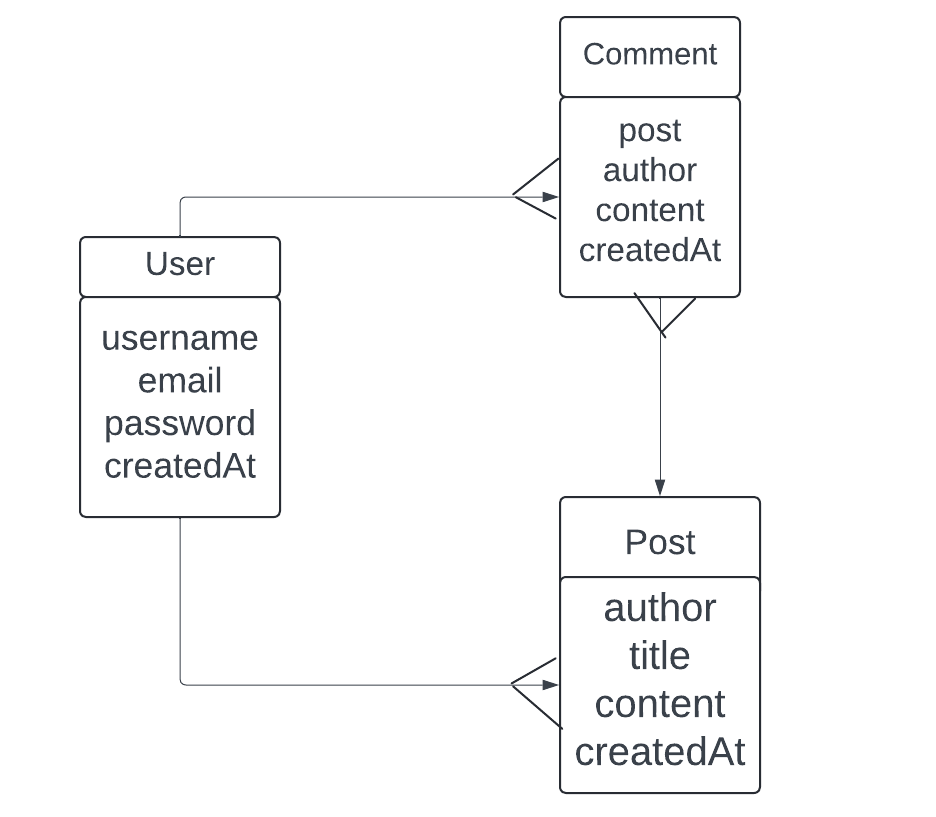
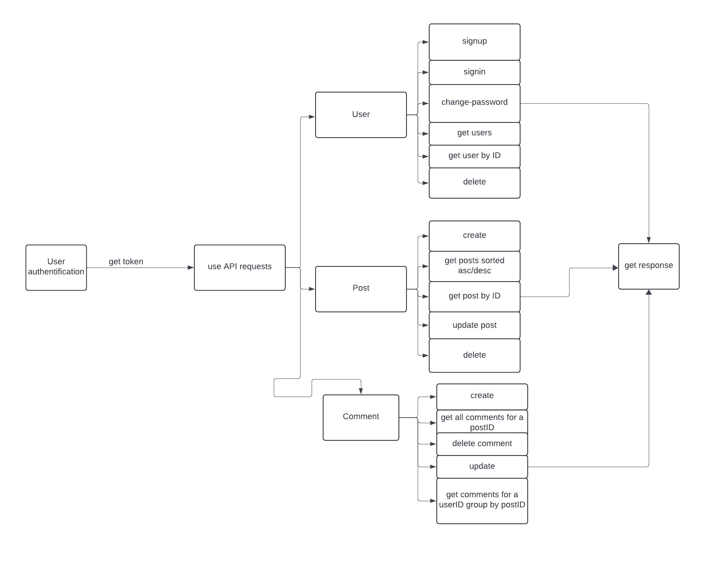

# Node.js Project Documentation - REST API

## Descrierea Proiectului

Acest proiect reprezintă un REST API pentru un Blog.
Funtionalitatiile includ operatii CRUD pentru cele 3 entitati (User, Comment, Post), autentificare JWT, rute publice si private.

## Configurare și Instalare

1. **Clonarea Repository-ul**  
   ```bash
   git clone https://github.com/AntoniaOancea/NodeJs---project


2. **Instalarea dependentelor**
   ```bash
   npm install

3. **Variabilele env**
    'PORT': Portul pe care va rula serverul
    'DB_URL': String-ul de conexiune catre baza de date MongoDB
    'JWT_SECRET': O cheie secreta pentru generarea si verificarea token-urilor JWT

4. **Rularea aplicatiei**
    ```bash
    npm start

5. **Accesarea documentatiei API-ului**
    Navigheaza catre '/api-docs' in browser pentru a vizualiza documentatia.


## Fluxuri API
Un potential client ar putea urma pasii urmatori pentru a utiliza API-ul:

1. Inregistare/Autentificare
Utilizatorul se inregistreaza sau se autentifica pentru a obtine un token JWT.

2. Accesare rute publice:
Accesarea rutelor publice pentru a obtine date.

3. Accesare rute private:
Folosind token-ul JWT, utilizzatorul poate accesa rutele private.

4. Operatiuni CRUD
    
    1. User: signup, signin, change-password, get users, get user by ID, delete user
    2. Post: create, get posts sorted, get post by ID, update post, delete post
    3. Comment: create , get all comments for a post, delete comment, update, get all comments for a user group by post

## Diagrama bazei de date
   


## Flow Chart Diagram
   
